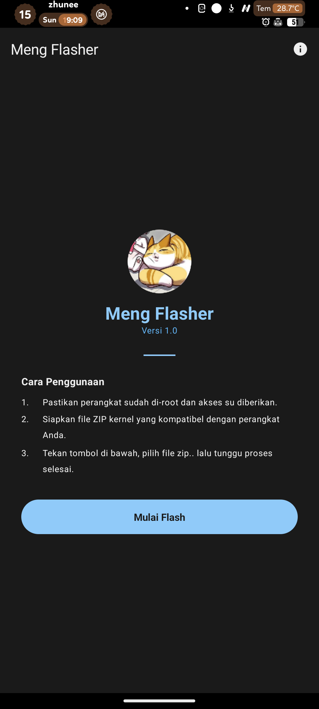
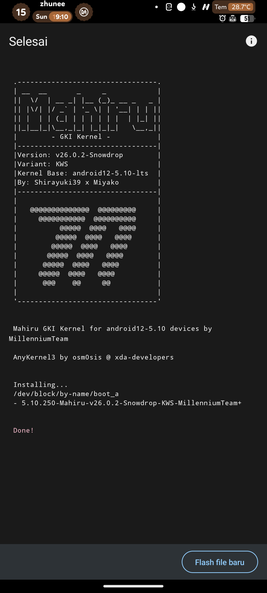
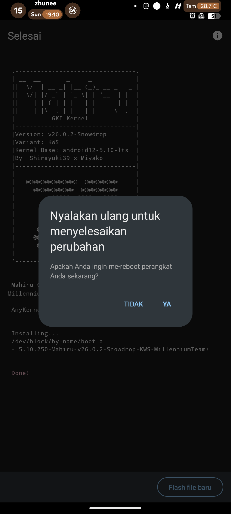

# Meng Flasher

A simple Android app to flash [AnyKernel3](https://github.com/osm0sis/AnyKernel3) flashable kernel zips.

## Screenshots

  
  
  

## What is this?

A simple app that can flash [AnyKernel3](https://github.com/osm0sis/AnyKernel3) flashable zips on Android. Root access via `su` is required.

## Source

This project is based on [HorizonKernelFlasher](https://github.com/libxzr/HorizonKernelFlasher) by [LibXZR](https://github.com/libxzr).

Customized and rebuilt using Kotlin + Jetpack Compose with Material 3 by [Juni](https://github.com/juns37).

## Prebuilt binary

- [mkbootfs](https://github.com/libxzr/mkbootfs)

## License

[GNU General Public License v3.0](LICENSE)
